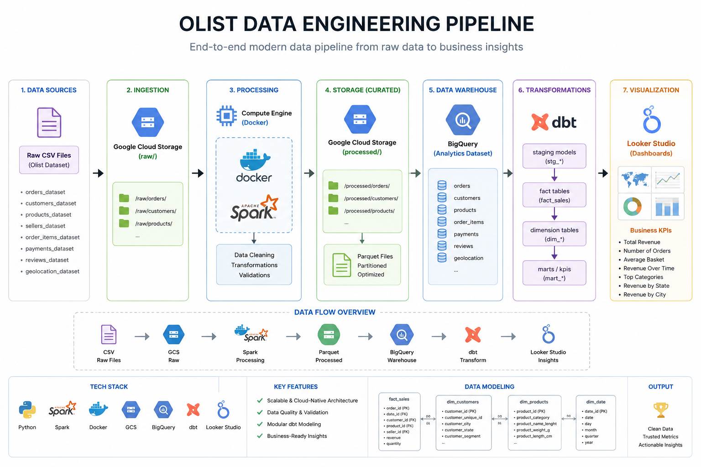
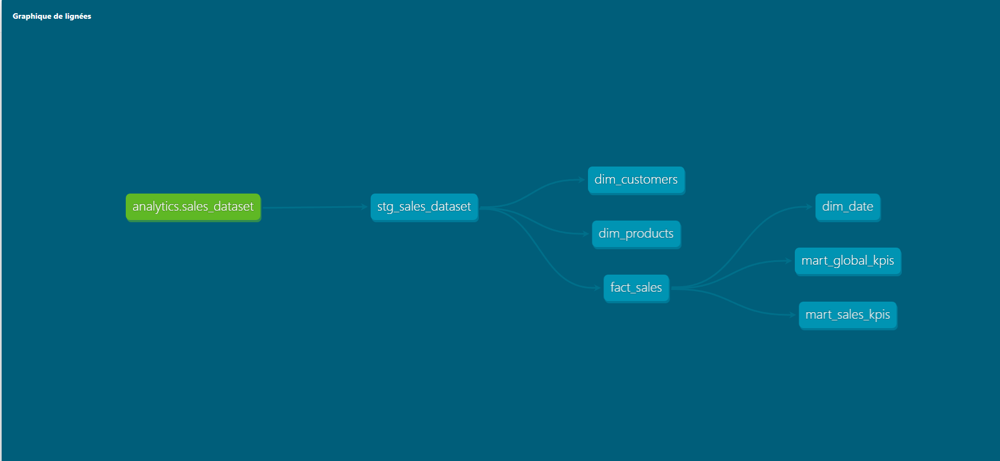
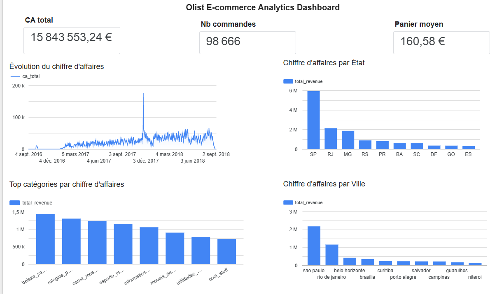

# Olist Data Engineering Pipeline

## Overview

This project is an end-to-end batch Data Engineering pipeline built on the Brazilian Olist E-commerce dataset.

The pipeline demonstrates how raw data is ingested, transformed, orchestrated and modeled using a modern cloud data stack.

The workflow automatically processes raw CSV files into analytics-ready datasets and business dashboards.

---

## Architecture



---

## Tech Stack

- Python
- Apache Spark
- Docker
- Apache Airflow
- Google Cloud Storage (GCS)
- BigQuery
- dbt
- Looker Studio
- SQL

---

## Dataset

The project uses the Brazilian Olist E-commerce Public Dataset.
Dataset source: https://www.kaggle.com/datasets/olistbr/brazilian-ecommerce

It contains information about:

- Orders
- Customers
- Products
- Sellers
- Payments
- Reviews
- Geolocation

---

## End-to-End Pipeline

The pipeline is orchestrated with Apache Airflow.

1. Validate raw CSV files
2. Execute Apache Spark processing
3. Validate generated Parquet files
4. Upload Parquet files to Google Cloud Storage
5. Load data into BigQuery
6. Build analytical models with dbt
7. Validate data quality using dbt tests
8. Visualize business KPIs with Looker Studio

---

## Airflow DAG

The Airflow DAG orchestrates the complete workflow from ingestion to data quality validation.

Current tasks:

- check_csv_files
- run_spark
- check_parquet
- upload_to_gcs
- load_to_bigquery
- run_dbt
- test_dbt

Example production schedule:

```python
schedule="0 2 * * *"
```

(Runs every day at 02:00 AM)

For this portfolio project, scheduling is intentionally disabled (`schedule=None`) to avoid unnecessary cloud costs.

---

## Data Modeling

The dbt project follows a layered analytical architecture.

### Staging

- stg_sales_dataset

### Fact

- fact_sales

### Dimensions

- dim_customers
- dim_products
- dim_date

### Business Marts

- mart_sales_kpis
- mart_global_kpis

---

## dbt Lineage



---

## Dashboard

The Looker Studio dashboard includes:

- Total Revenue
- Number of Orders
- Average Order Value
- Revenue over Time
- Revenue by Product Category
- Revenue by City
- Revenue by State



---

## Project Structure

```text
olist-data-engineering/
│
├── airflow/
│   ├── dags/
│   └── compose.airflow.yaml
│
├── data/
│   ├── sample/
│   └── processed/
│
├── dbt/
│
├── docs/
│
├── Docker/
│
├── src/
│
├── tests/
│
├── compose.yaml
│
└── README.md
```

---

## Key Features

- End-to-end batch pipeline
- Apache Airflow orchestration
- Apache Spark data processing
- Cloud storage using Google Cloud Storage
- BigQuery Data Warehouse
- dbt transformations
- dbt data quality tests
- Dockerized services
- Business dashboard with Looker Studio

---

## Google Cloud credentials

This project requires a Google Cloud Service Account.

Create your own Service Account with the required permissions.

Place the downloaded JSON key here:

dbt/.keys/dbt-bigquery-sa.json

This directory is ignored by Git for security reasons.

---

## Prerequisites

- Docker Desktop
- Docker Compose
- A Google Cloud project
- A Google Cloud Service Account with access to GCS and BigQuery

---

## Run the project

### 1. Clone the repository

```bash
git clone <repository-url>
cd olist-data-engineering
```

### 2. Add Google Cloud credentials

Place your own Service Account JSON key at:

```text
dbt/.keys/dbt-bigquery-sa.json
```

Credentials are excluded from Git for security reasons.

### 3. Validate the dbt connection

```bash
docker compose run --rm dbt debug
```

### 4. Build the Spark image

```bash
docker compose build spark
```

### 5. Start Airflow

```bash
docker compose -f airflow/compose.airflow.yaml up --build
```

The Airflow interface is available at:

```text
http://localhost:8080
```

### 6. Trigger the pipeline

Open the Airflow interface and manually trigger:

```text
olist_pipeline
```

---

## Security

Service Account keys, local dbt profiles, logs, generated Parquet files and build artifacts are excluded through `.gitignore`.

No cloud credentials are stored in this repository.